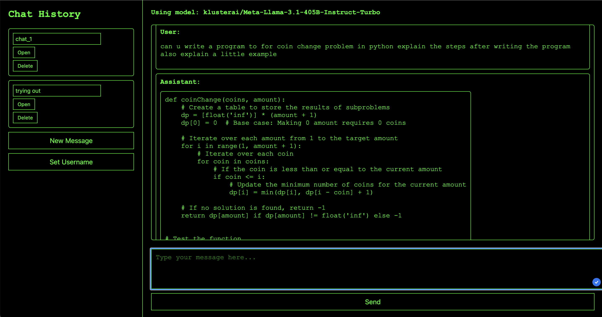

# Project Title

A brief description of your project.

## Project Structure

Ensure the following files are in the root directory of your project:

- `index.html`
- `styles.css`
- `script.js`

## Running the Project

To view the project locally, start a simple HTTP server. You can use any simple HTTP server; here, we use `http-server` as an example:
**note** : ``` to just run :
            npm install
            npm start or node server.js
            ```
1. **Install `http-server`:**

    ```sh
    npm install -g http-server
    ```

2. **Start the server in the project directory:**

    ```sh
    http-server
    ```

3. **Open your browser and navigate to:**

    ```
    http://localhost:8080
    ```

## How It Works

### Set Your API Key

1. Click the **"Set API Key"** button in the sidebar.
2. Enter your Kluster.ai API key in the prompt.

### Select a Model

1. Choose a model from the dropdown menu in the main interface.
2. Click **"Start Chat"** to begin a new chat session.

### Send Messages

1. Type your message in the text area at the bottom.
2. Click **"Send"** to interact with the Kluster.ai API.
3. The chat history will display your messages and the assistant's responses.

### Manage Chat Sessions

- Rename or delete chat sessions using the respective buttons in the sidebar.

### Set Your Username

1. Click the **"Set Username"** button in the sidebar.
2. Enter your preferred username in the prompt.

### Copy Code Snippets

- If a response contains code, a small **"Copy"** button will appear next to the code block.
- Click the **"Copy"** button to copy the code to your clipboard.

## Link to Kluster.ai

For more information, visit [Kluster AI](https://www.kluster.ai/).

## Screenshots


*Description of Screenshot 1*


## License

This project is licensed under the MIT License. See the [LICENSE](LICENSE) file for details.
